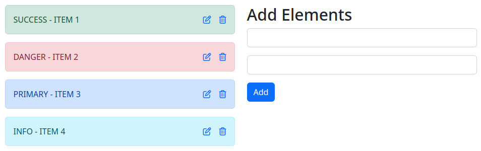

# CRUD 🐘

## Build with
- Written in php
- Styles with boostrap 5
- MySQL database

## User actions
- Create/Add item
- Edit which one item you select
- Delete whatever one you want
- Read DB on every reload. Data persist in my computer 🤡

## Screenshot

